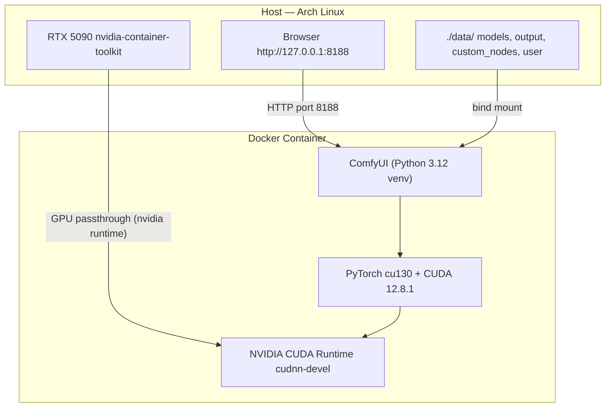
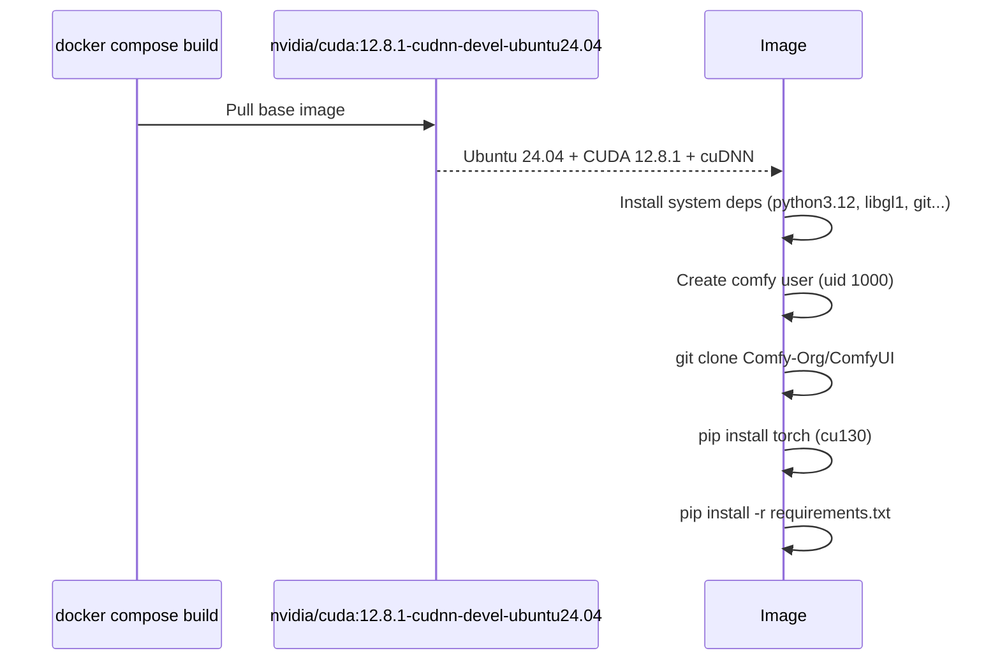
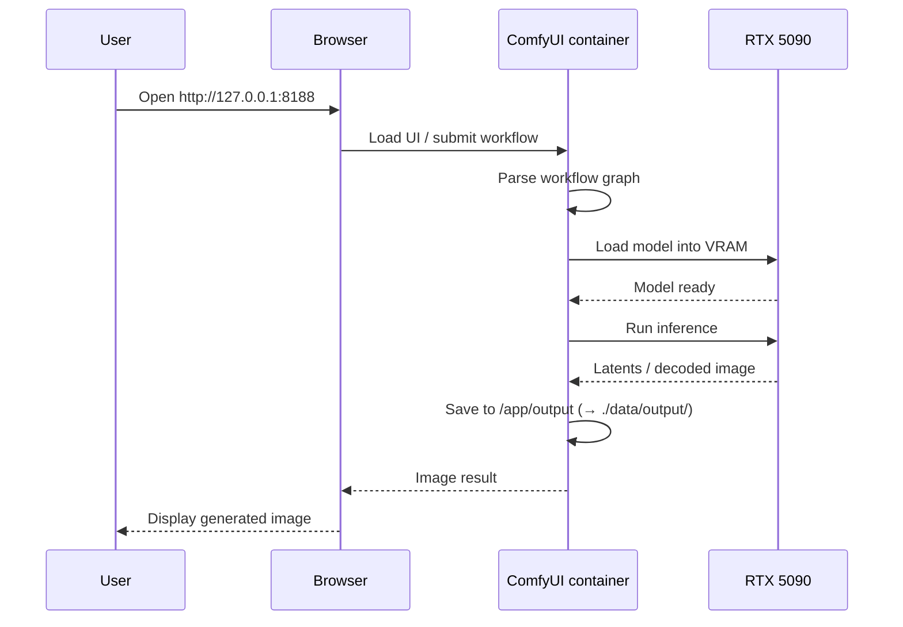

# ai_art_workflow

Containerized [ComfyUI](https://github.com/Comfy-Org/ComfyUI) setup with NVIDIA GPU passthrough, optimized for the RTX 5090 (Blackwell architecture).

## Requirements

### Host (Arch Linux)

1. **NVIDIA drivers 570+** — required for Blackwell / RTX 5090:
   ```bash
   sudo pacman -S nvidia nvidia-utils
   ```

2. **nvidia-container-toolkit** — enables GPU passthrough into Docker:
   ```bash
   sudo pacman -S nvidia-container-toolkit
   sudo nvidia-ctk runtime configure --runtime=docker
   sudo systemctl restart docker
   ```

3. **Docker** with Compose:
   ```bash
   sudo pacman -S docker docker-compose
   sudo systemctl enable --now docker
   ```

## Usage

### Build
```bash
docker compose build
```
First build takes a while — it pulls the CUDA base image and installs PyTorch with CUDA 13.0 support.

### Start
```bash
docker compose up -d
```
ComfyUI will be available at **http://127.0.0.1:8188**

### Stop
```bash
docker compose down
```

### View logs
```bash
docker compose logs -f
```

### Verify GPU is visible inside the container
```bash
docker exec comfyui nvidia-smi
```

## Project Structure

```
ai_art_workflow/
├── Dockerfile                 # Container image definition
├── docker-compose.yml         # Service, ports, volumes, GPU config
├── .env                       # Port and GPU device overrides
├── extra_model_paths.yaml     # Maps model subdirectories for ComfyUI
└── data/                      # Persisted data (survives container rebuilds)
    ├── models/
    │   ├── checkpoints/       # Stable Diffusion / Flux checkpoints
    │   ├── loras/
    │   ├── vae/
    │   ├── controlnet/
    │   ├── clip/
    │   ├── diffusion_models/
    │   ├── embeddings/
    │   └── upscale_models/
    ├── custom_nodes/          # ComfyUI-Manager installed nodes
    ├── output/                # Generated images
    └── user/                  # Workflows and settings
```

## Configuration

Edit [.env](.env) to change defaults:

| Variable | Default | Description |
|---|---|---|
| `COMFYUI_PORT` | `8188` | Host port ComfyUI is served on |
| `CUDA_VISIBLE_DEVICES` | `0` | Which GPU to use (0-indexed) |

## Adding Models

Drop model files into the appropriate subdirectory under `data/models/` — they are immediately available to ComfyUI without restarting the container.

| Model type | Directory |
|---|---|
| Checkpoints (SD, Flux, etc.) | `data/models/checkpoints/` |
| LoRAs | `data/models/loras/` |
| VAE | `data/models/vae/` |
| ControlNet | `data/models/controlnet/` |
| CLIP / text encoders | `data/models/clip/` |
| Upscalers | `data/models/upscale_models/` |

## How It Works



### Build-time flow



### Runtime flow


